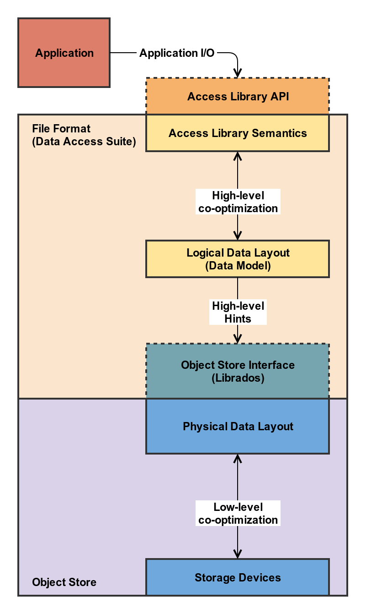

# Accelerate Human Cell Atlas (XHCA)
-------------------------------

## Overview
This is a repository for a collaborative project between Peter Alvaro's lab, Josh Stuart's lab, and Seagate.
The overall goal is to research improvements in storage systems and smart disks to improve data storage for
bioinformatics applications--especially the Human Cell Atlas.

Figure 1, below, highlights three primary components: (1) the scientific application, (2) the access library
interface, and (3) the storage system interface. The figure also shows how these components are related, and
how they can be grouped into file format (access library) and storage system (object store). In short, one
of the goals of this project is to explore how to provide high-level information from the application to
the storage system so that the storage system can choose optimal low-level policies and mechanisms to support
high-level abstractions and computation.

<figure>
  
  <figcaption text-align:"middle">
    <strong>Figure 1</strong>
    Overview of components of the data access path and annotated interactions.
  </figcaption>
</figure>

## Reproducibility
For reproducibility, we are interested in using popper, which in turn uses containers and the github actions
workflow language. In order to consolidate our environment and dependencies for portability, we will build an
image that can launch containers (popper launches containers per the workflow). See [this link][docker-subcontainers].

## Practical

## Scientific Domain

## Storage

### From a Database Perspective

A good overview of the storage system from a database perspective (e.g. the storage engine of a database) is provided
by Andy Pavlo (CMU) in [a recorded lecture for the CMU 15-721 course][lecture-pavlo-storage]. For more info from his
course/lecture, checkout out [his course schedule][schedule-pavlo-storage]. Andy Pavlo presents his lecture on the topic
with the following overall points (my interpretation, not his explanation):

* How does a database system organize and persist data?
    * Data index
    * Fixed-length data
    * Variable-length data
* What concrete data types are used to represent logical data types
* Data layout
    * How to handle special (null) values
    * Word alignment
* Storage model (basically row-based vs column-based)

<!-- resources -->
[docker-subcontainers]:   https://jpetazzo.github.io/2015/09/03/do-not-use-docker-in-docker-for-ci/#the-solution
[lecture-pavlo-storage]:  https://www.youtube.com/watch?v=BuKmw3CFHYY&list=PLSE8ODhjZXja7K1hjZ01UTVDnGQdx5v5U&index=9
[schedule-pavlo-storage]: https://15721.courses.cs.cmu.edu/spring2019/schedule.html#feb-13-2019
