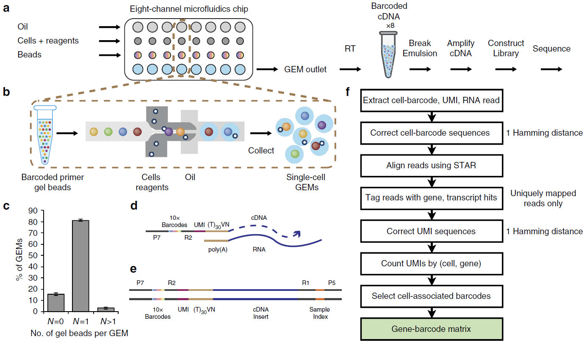

# Overview

## Summary

- The biologists are most interested in cell type analysis, or clusters of cells.

- The biologists are interested in a system that they can provide: (1) cell data (gene expression
  data) and (2) cluster labels (or, more generally, cell annotations such as cell types).

- The biologists are interested in making two categories of queries: (1) retrieve cell data from
  the system given a set of cell types and, optionally, annotations to filter on and (2) retrieve
  genes that are up-regulated (have higher expression) or down-regulated (have lower expression)
  for certain cell types and, optionally, cell or gene annotations.

- There are thus two "contexts" of analysis: (1) Cells and genes and their annotations and (2)
  cells and genes using expression data. For now, the first context will be referred to as
  a "cellular" context, and the second context will be a "molecular" context.

- For the cellular context:

    - Cells are fully independent and there is no constraint on how annotations are processed. This
      means that all approaches to distribution across smart drives may be considered.

    - The system should be concerned with how to pushdown predicates on annotations and to
      efficiently retrieve cell and gene information, with little need to process expression data.
      This is especially true if the minimal processing necessary (e.g.  comparing cell type
      representatives, or cluster centroids, to each other) is done at time of ingest rather than
      data access time.
  
- For the molecular context:

    - Cells may be independently processed, but aggregate information is needed over cells with the
      same varying scopes of locality: in the same matrix (from the same sequencing lane?), from
      the same assay, from the same lab, etc.

    - The system is expected to use distance or similarity functions to compare cells or genes in
      order to do some of the following: clustering, filtering, QC, or translation (such as
      normalization or perhaps from raw expression to BP).

<figure>
  
  <figcaption>Figure 1: High level diagram illustrating the purpose of the XHCA project.</figcaption>
</figure>

## Open Questions

### Data sources

- Where will data come from and how does that affect ingest into "the system" or the smart drives?

    - Will data come from a normalized, consolidated source such as the HCA Data Portal?

    - Will data come in a variety of formats, such as directly from sequencing labs or from
      disparate pipelines?

    - In what scenarios will the ingest granularity differ from gene expression (cells, genes,
      counts)?

- What data formats will "the system" be expected to maintain?

    - Assuming loom or MTX files will continue being used, will the system be expected to produce
      data in these formats?

    - Will "the system" need to provide data organized by single cell in serialization formats for
      file systems or just for transfer over the network?

    - Should "the system" maintain durable data in accessible formats or can it maintain durable
      data opaquely as in a single, giant database?

### Query results

- How should results or outputs be returned and/or stored?

    - Should queries return results directly to a "user"?

    - To what extent should query results be accessible to others?

    - Do we expect to grow existing objects (frequent updates) or add new ones (insert only)?

    - To what extent should intermediate results or query results be cached?

# Components

## Data Lifecycle

What is the end-to-end lifecycle for each data object?

### Biological Data

#### Physical Process

A **cell** corresponds to a biological cell that was sequenced using some single-cell
RNA sequencing technology. Single-cell sequencing generates some number of RNA sequences, which can
each be mapped to a particular gene. For each gene, the number of RNA sequences that can be mapped
to it is known as it's expression.

<figure>
  
  <figcaption>
    Figure 2 (Figure 1 of https://doi.org/10.1038/ncomms14049): (a) Workflow of scRNA-seq using 10X
    Genomics' GemCode technology. (b) A cross-section of the workflow in (a) that shows how gel
    beads, biological cells, reagents, and oil are collected together into "Single-Cell GEMs" (GEM
    is *g*el bead in *em*ulsion). (c) Distribution of gel beads per GEM which yields sufficient
    confidence that transcriptional profiles are on a single cell basis. (d) Biological entities
    that are contained in each gel bead. (e) Biological entities that are contained in the fully
    constructed library (final step before sequencing in (a)). (f) Workflow of 10X Genomics's
    cellranger analysis pipeline.
  </figcaption>
</figure>

#### Abstraction and Data Model

There are three high-level entities that "the system" must maintain and process: gene expression,
cell annotations, and gene annotations.

In the biological data model, we have three primary entities: cells, genes, and a gene expression
matrix.  Single-cell sequencing is interested in the expression of every
gene for every cell, which is stored in a gene expression matrix. For simplicity, the XHCA project
assumes that gene expression matrices represent genes as rows (`r`) and cells as columns (`c`),
where every position in a matrix is the expression of the gene in the cell (`m[r, c]`).

<figure>
  
  <figcaption>Figure 3: Sketch of an ERD for gene expression matrices and annotations.</figcaption>
</figure>

In addition to the three primary entities, there is a meta-entity of interest: a cell type. A cell
type is a logical representation of a set of similar cells, or a cluster of cells. Once a cell is
associated with a cluster, or cell type, that cell can be "annotated" with that cluster ID.
Canonically, cells are compared by comparing the expression of all of their genes, but the exact
similarity metric used is an implementation detail.

[Figure 2](#erd-sketch), above, shows a rough sketch of an entity-relationship diagram for
representing the gene expression matrix, cell annotations, and gene annotations in a relational
model. The key points here are:

1. Processing of the gene expression matrix will use both the cell and gene dimensions
   frequently.
1. In a de-normalized approach, cell types (clusters) can be represented as a simple string and
   processing of cell annotations can leveerage the string instead of walking multiple
   relations.
1. Although a good initial approach is unclear, cell type representatives are a single vector
   and if a cell is similar to that vector then it can be considered of that cell type.
1. To query gene expressions across many cells would require filtering and aggregation over
   many gene expression matrices for a subset of genes.
1. Genes may be a part of many "gene sets", or sets of genes that are biologically related in
   their influence of the organism's phenotype or genotype. In a relational database these
   would likely be represented as a table of GeneSets which would identify each gene set and
   metadata, and a table with foreign keys into GeneSets and GeneAnnotations. However, the
   implementation of such a mechanism in a storage system is not clear.

### Storage Data Model

A storage system provides a single interface for storing data on storage devices. For the XHCA
project, there are two possibilities: (1) the storage system will have many OSDs, each of which is
connected to a set of smart drives, or (2) the storage system defines an interface that each smart
drive provides. In both cases, there will need to be some way to discover which OSDs or smart
drives to communicate with. It is not clear how this should be done at the moment.

In the first case, OSDs will receive requests, and translate those requests into tasks for each
smart drive. This is represented in [Figure 1](#system-architecture-diagram) above, as the OSD
with many smart drives contained within (one or many OSDs are possible). In the second case, a
request will be broadcast to each drive in a way that they can process the request and respond with
the desired data set. This is represented in the figure as the "Direct Fabric" which has many
contained smart drives.

Any computation that the storage system attempts to do offline such as re-computing annotations or
computing new derived annotations (such as cluster labels) is known as "offline pushdown" and
discussed in [Computation inside of the storage system](#inside-of-the-storage-system).

### Mapping across the divide

From the biological perspective we are interested in loading gene expression matrices, cell
annotations, and possibly gene annotations. Included in the cell annotations would be cluster
labels or cell types. The storage system would then need to decide how should the data be stored to
optimize offline pushdowns or data traversal during data access. This might mean that gene
expression matrices for cluster representatives are co-located, or gene expression matrices for
clusters are uniformly sharded, or gene expression matrices are striped across smart drives based
on content (so that each smart drive has an equal share of actual values). Maybe the storage system
will want to store materialized views for a "hot" subset of queries, or maybe the storage system
will want to co-locate cells by cell type. Additionally, the storage system may want to shuffle
data based on workload patterns.

## Computation

### Outside of the storage system

Biological applications may be interested in doing "local" computation over gene expression
matrices, such as running their own clustering analysis. In these cases, clients may want to update
annotations for cells or genes.

### Inside of the storage system

It may be possible for the storage system to improve compute efficiency by running offline
transformations on the data in the background. Then, when compute needs to happen, such as
clustering analysis or some other vectorizable computations, the data can be streamed out of the
storage system in a format that is packed and minimal.

### Queries

For a prototype system, we are interested in providing a system that can be queried by biologists.
Queries should be serviced at "interactive" speeds, which means that the storage system should act
as a "pile" system that takes data dumps, processes them in the background, and then is able to
serve queries with data in the necessary format. Alternatively, this may mean that the storage
system should provide initial results or sub-sampled results and stream the results to a user or
shuffle data to minimize data access latency. This will essentially rely on the tuning knob: should
we optimize data for access at time of ingest (eager), or should we do optimization at query or
data access time to make subsequent executions of the query or data access extremely fast (lazy).

## Storage

### Direct Fabric

### Storage Servers (OSDs)

# Terminology

- UMI: a **U**nique **M**olecular **I**dentifier. A short sequence of synthesized DNA that uniquely
  identifies RNA that has been grouped by a droplet. Essentially, a unique primary key for a single
  cell.

- Transcript: An RNA sequence that can be generated from the DNA sequence of a gene.

- Genome: The entire DNA sequence for an organism.

- Transcriptome: The set of all known transcripts that can be generated from a given genome.

- Single-cell RNA sequencing: A sequencing method that isolates biological cells, and produces a
  set of RNA sequences, which were "read" from each cell. Each cell generates many RNA sequences,
  and each RNA sequence can be mapped to a gene in the transcriptome.

- Annotation: any metadata that describes a biological entity

- Cell: A single biological cell that was sequenced. More abstractly, the physical entity for which
  a single-cell sequencing assay associates reads. A cell is usually identified by a UMI

- Gene: A region of DNA that codes for a particular biological protein.

- Cell annotations: metadata associated with a particular, sequenced cell. This can include the
  UMI, a cell type, sampling metadata such as source tissue, sequencing metadata such as assay,
  etc.

- Gene annotations: metadata associated with a particular gene. This can include pathways that the
  gene participates in (biological pathways that interact with the protein that the gene codes
  for), a human readable symbol, an ID such as NCBI gene ID, etc.

- OSD: An **O**bject **S**torage **D**evice (or **D**aemon). This is the name that the Ceph storage
  system uses for storage servers.

- Smart Drive: A storage drive that has an attached processor of some kind. This may be an SSD with
  an ARM CPU or an SSD with an attached FPGA and ARM CPU, or any other mixture of processors and
  storage medium.

- Direct Fabric: Fabric is the network connection to a smart drive, and "direct fabric" is an
  arbitrary term to refer to an architecture where a particular server that is attached to a set of
  smart drives is **not** an OSD.

# Introduction (work in progress)

Note: below is an attempt to relate the technical jargon to a description of the scientific use
case.

The human cell atlas is concerned with accumulating knowledge of the "cellular landscape" of the
human body. In understanding the complexities of cells throughout the body and the variation of
expression across cells of each organ system, the human cell atlas, and an atlas for each organ
system, aims to accelerate medical science.

The primary entities that we work with are biological cells (what is being sequenced), the genes
for the sampled organism, and the expression of each gene in each cell. More colloquially, we are
interested in the quantities (expression) of each protein (gene) in every cell of the human body.
There are three abstractions in which our analysis operates: (1) the physical, (2) the space of all
biological representations (transcriptome, genome, cell atlas), and (3) the effects of a human (or
organ) having a specific subset of biological representations--or the co-occurrence of (1) and (2).

The physical abstraction is represented by single-cell RNA sequencing and digitizing the physical
cellular state of a biological sample.

The transition to "the space of all biological representations" from sequencing is done by
classifying cells into cell types and the expression across all genes of a cell into a cellular
state. Essentially, the cellular landscape is an attempt to catalogue all existing cells into
functional equivalence classes (what role in the organism does this cell play), and further
separating those functional classes into correctness equivalence classes (is this cell working
correctly, or is it malfunctioning).

Finally, to make the theoretical problem tractable, we restrict the analysis of "all possible
biological representations" to the specific biological existence that is found in a human. Or, in
other words, once we have sequenced a sample we can map accumulated knowledge from the human cell
atlas to a specific individual.
